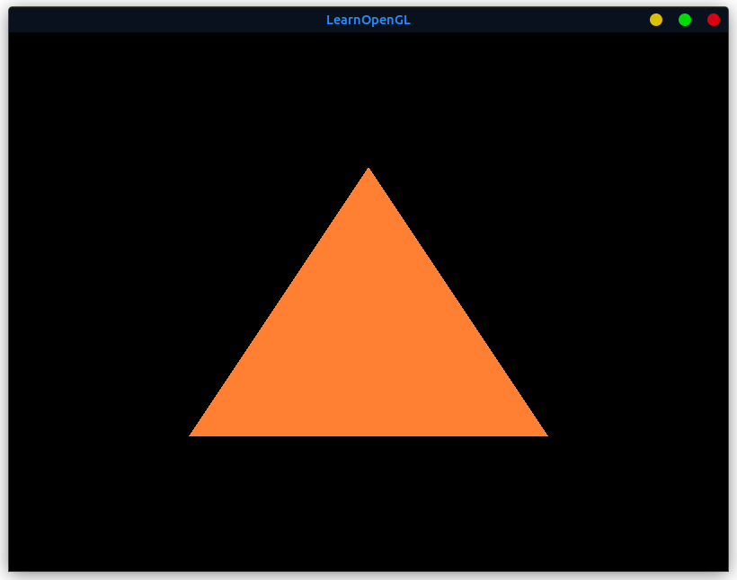

# 用OpenGL渲染三角形

## 准备工作

既然要渲染三角形，那么我们就需要一个三角形的顶点数据。

```cpp
float vertices[] = {
    -0.5f, -0.5f, 0.0f,
     0.5f, -0.5f, 0.0f,
     0.0f,  0.5f, 0.0f
};
```

> 注：我们把三个顶点的z值都设为0，因为我们“假装”在2D空间中绘制，所以z值都为0。

## VBO

OpenGL是一个大状态机，我们需要先创建一个顶点缓冲对象(Vertex Buffer Object, VBO)，然后把我们的顶点数据复制到缓冲的内存中，供OpenGL使用。

```cpp
unsigned int VBO;
glGenBuffers(1, &VBO);
```

OpenGL有很多缓冲对象类型，顶点缓冲对象的缓冲类型是`GL_ARRAY_BUFFER`。

```cpp
glBindBuffer(GL_ARRAY_BUFFER, VBO);
```

从这一刻起，我们使用的任何在`GL_ARRAY_BUFFER`目标上的缓冲调用，都会用来配置当前绑定的缓冲(`VBO`)。

然后我们将顶点数据复制到缓冲的内存中。

```cpp
glBufferData(GL_ARRAY_BUFFER, sizeof(vertices), vertices, GL_STATIC_DRAW);
```

## Vertex Shader

顶点着色器(Vertex Shader)是我们在OpenGL中的第一个着色器。它的目的是把3D坐标转换为另一种3D坐标（在OpenGL中，所有的坐标都是3D坐标），同时顶点着色器允许我们对顶点属性进行一些基本处理。

```glsl
#version 330 core
layout (location = 0) in vec3 aPos;

void main()
{
    gl_Position = vec4(aPos.x, aPos.y, aPos.z, 1.0);
}
```

### 编译着色器

```cpp
unsigned int vertexShader;
vertexShader = glCreateShader(GL_VERTEX_SHADER);
glShaderSource(vertexShader, 1, &vertexShaderSource, NULL);
glCompileShader(vertexShader);
```

其中`glShaderSource`函数把要编译的着色器源码作为参数传递进去。

## 片段着色器

片段着色器(Fragment Shader)的主要目的是计算一个像素的最终颜色，这也是为什么它有时候也被叫做像素着色器(Pixel Shader)。

```glsl
#version 330 core
out vec4 FragColor;

void main()
{
    FragColor = vec4(1.0f, 0.5f, 0.2f, 1.0f);
}
```

### 编译着色器

```cpp
unsigned int fragmentShader;
fragmentShader = glCreateShader(GL_FRAGMENT_SHADER);
glShaderSource(fragmentShader, 1, &fragmentShaderSource, NULL);
glCompileShader(fragmentShader);
```

## 着色器程序

我们已经成功编译了两个着色器，但是我们还需要把它们链接(Link)为一个着色器程序(Shader Program)，然后在渲染对象的时候激活这个着色器程序。

```cpp
unsigned int shaderProgram;
shaderProgram = glCreateProgram();
glAttachShader(shaderProgram, vertexShader);
glAttachShader(shaderProgram, fragmentShader);
glLinkProgram(shaderProgram);
```

### 激活着色器程序

```cpp
glUseProgram(shaderProgram);
glDeleteShader(vertexShader);
glDeleteShader(fragmentShader);
//不再需要着色器对象，可以删除了
```

## VAO

我们已经将数据发送给了GPU，但是我们还需要告诉OpenGL如何解释这些顶点数据。

```cpp
unsigned int VAO;
glGenVertexArrays(1, &VAO); 
glBindVertexArray(VAO);
glVertexAttribPointer(0, 3, GL_FLOAT, GL_FALSE, 3 * sizeof(float), (void*)0);
glEnableVertexAttribArray(0);
```

结果如图:

