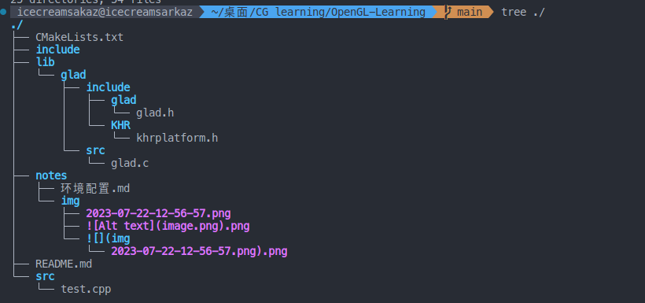
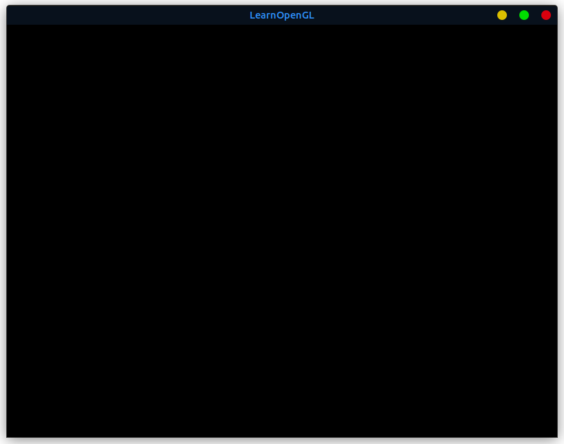

# 环境配置(Linux)

## 安装OpenGL

```shell
sudo apt-get install build-essential
sudo apt-get install libgl1-mesa-dev
```

## 安装GLFW

```shell
sudo apt install libglfw3-dev
```

## 安装GLAD

点击[此处](https://glad.dav1d.de/)进入到GLAD网站

.png)

点击Genertae(未截屏到)生成文件

.png)

下载glad.zip

将glad文件扔到项目文件夹的lib文件夹下



## CMakeLists.txt内容

```CMake
cmake_minimum_required(VERSION 3.21)
 
project(my_project)
 
find_package(OpenGL REQUIRED)
add_library(glad lib/glad/src/glad.c)
target_include_directories(glad  PUBLIC lib/glad/include)
 
set (CMAKE_CXX_LINK_EXECUTABLE "${CMAKE_CXX_LINK_EXECUTABLE} -ldl") 
 
add_executable(test src/test.cpp)
target_link_libraries(test glfw ${GL_LIBRARY} glad)
```

## test.cpp内容

```cpp
#include <glad/glad.h>  // 必须为首句
#include <GLFW/glfw3.h>
#include <iostream>
 
void framebuffer_size_callback(GLFWwindow* window, int width, int height)
{
    glViewport(0, 0, width, height);
}
 
int main()
{
    glfwInit();
    glfwWindowHint(GLFW_CONTEXT_VERSION_MAJOR, 3);
    glfwWindowHint(GLFW_CONTEXT_VERSION_MINOR, 3);
    glfwWindowHint(GLFW_OPENGL_PROFILE, GLFW_OPENGL_CORE_PROFILE);
    //glfwWindowHint(GLFW_OPENGL_FORWARD_COMPAT, GL_TRUE);
GLFWwindow* window = glfwCreateWindow(800, 600, "LearnOpenGL", NULL, NULL);
if (window == NULL)
{
    std::cout << "Failed to create GLFW window" << std::endl;
    glfwTerminate();
    return -1;
}
glfwMakeContextCurrent(window);
if (!gladLoadGLLoader((GLADloadproc)glfwGetProcAddress))
{
    std::cout << "Failed to initialize GLAD" << std::endl;
    return -1;
}
glViewport(0, 0, 800, 600);
 
glfwSetFramebufferSizeCallback(window, framebuffer_size_callback);
while(!glfwWindowShouldClose(window))
{
    glfwSwapBuffers(window);
    glfwPollEvents();    
}
glfwTerminate();
    return 0;
}
```

然后运行,结果如图：



说明环境配置成功!!!